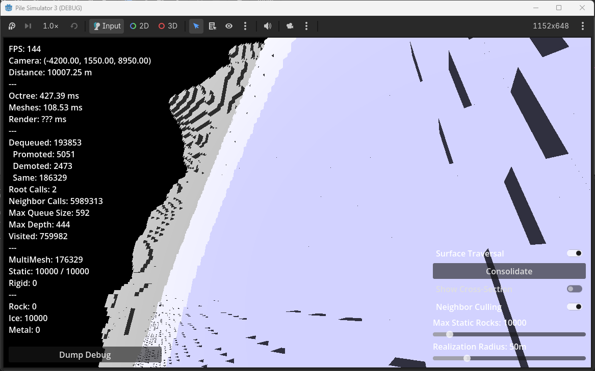
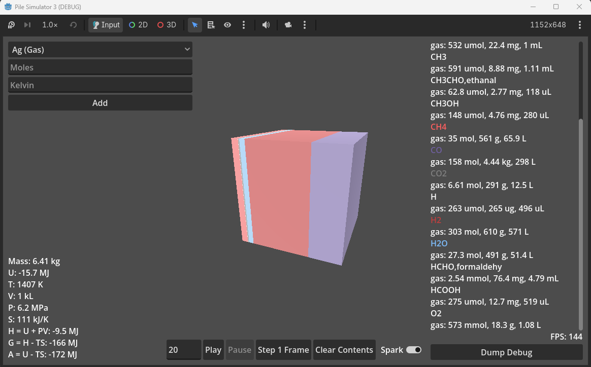
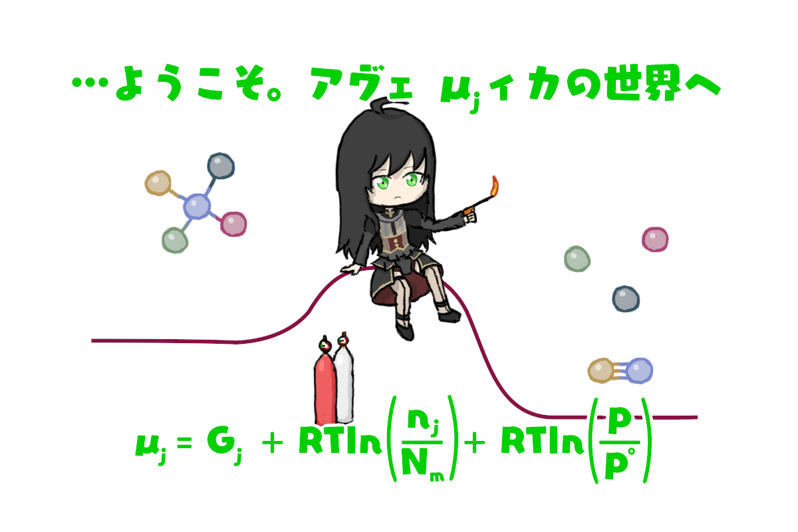

# Pile Simulator 3

Allegedly a game about asteroid mining and processing.

Right now there is not much to do, various systems will break if you look at it funny, and the systems that work are extremely slow.

Inspirations from Minecraft, various mining games on Roblox, Space Engineers, Stationeers, etc.

There are currently no builds. You will need to install Godot and build it yourself.

The main menu has two scenes available:
- World: A voxel asteroid you can freecam around
- BoxSim: A chemistry simulation of incomplete combustion

## World

You are placed near the surface of a 10 km radius asteroid made of rock, ice, and metal. 1 metre voxels within the realization radius are rendered as StaticBodies. Further structures are rendered as MultiMeshes of higher octree internal nodes.

It is incredibly stuttery and an awful experience.

Controls:
- WASDQE to move the camera (control directions are broken)
- Right click and drag to rotate the camera
- Scroll wheel to change speed
- Shift to temporarily increase speed

Settings:
- There is a debug label on the left showing what's going on in the LOD handler. Below that is a button to dump the debug to the Godot output.
- The bottom right has check buttons to toggle between:
- - Surface flood fill (much faster even though it stutters) vs Barnes-Hut volume traversal (completely unplayable)
- - Show cross section on the Z=0 plane (on the 10 km asteroid, the Z=0 plane is beyond Godot's 4000 m render distance and nothing will be visible)
- - Culling internal voxels with neighbors on all six faces
- There are also sliders:
- - Max Static Rocks: Limits the number of real voxels with physics colliders. Note that values above 10240 are broken unless you increase the project's MaxPhysicsBodies
- - Realization Radius: Affects the resolution of the render. Higher values increase detail at the cost of massive lag and memory usage

Future Plans:
- Fix the camera
- Figure out how to make rendering and traversal fast enough to be playable
- Removable and dislodgeable rocks
- Re-add lumpy gravity using the Barnes-Hut approximation and symplectic integrators from Rubble Pile Simulator

AI Acknowledgement:
- Kimi K2.5: Primary collaborator
- Opus 4.6: Surface flood fill and Samet's octree neighbor algorithm
- GPT-5.4, Gemini 3.1 Pro: Analyzing scaling of traversal methods

## BoxSim

A chemical reaction and phase simulation using the Element Potential Method and chemical potential. The initial scenario shows incomplete combustion of methane producing carbon monoxide and hydrogen.

Controls:
- The top left container allows you to add an amount of a chemical species at a given temperature. It currently breaks the solver.
- The bottom container allows you to:
- - Set the simulation FPS, play, and pause
- - Step forwards one frame
- - Clear box contents (you will need to immediately replenish with a gas or NaNs will show up)
- - Add a spark, which applies a floor amount of reactions every frame regardless of temperature
- Thermodynamic variables are on the bottom left, species amounts are on the right, and there is a button to dump that text to the Godot output.

Assumptions:
- BoxSim uses a weird mix of ideal and non-ideal behaviours.
- Reactions assume gases are ideal gases while liquids and solids are each ideal solutions.
- Some gases and liquids (for which I could source critical data) use cubic equations of state (Redlich-Kwong, Soave-Redlich-Kwong, Peng-Robinson).
- EOS do not use the mixing rules. There is an imaginary movable partition between each species that shares pressure and splits volume. Each species is a pure clump.
- Every species has a dissociation temperature. This is not the real-life dissociation temperature. It is the minimum temperature for 0.1% of moles to be liberated into the reaction solver every frame. It was added to prevent diamond from turning into graphite and random things combusting at standard conditions.
- The reaction solver is gas-only. It cannot produce a species that only has a liquid or solid phase defined.

It uses the Element Potential Method, described in STANJAN. I referred to this PDF from 1986:
- https://web.stanford.edu/~cantwell/AA283_Course_Material/AA283_Resources/STANJAN_write-up_by_Bill_Reynolds.pdf

Thermodynamic data comes from NASA Glenn Coefficients for Calculating Thermodynamic Properties of Individual Species
- https://ntrs.nasa.gov/citations/20020085330

Implementation is based on NASA Chemical Equilibrium with Applications:
- Web version https://cearun.grc.nasa.gov
- Downloadable version https://github.com/nasa/cea

Future Plans:
- Stabilize the solver
- Support direct production of liquid and solid species phases

AI Acknowledgement:
- DeepSeek V4 Pro: Primary collaborator
- GPT-5.5, Opus 4.7, Kimi K2.6: Debugging the solver, plus architecture advice

Welcome... to the world of Chemical Potential.

